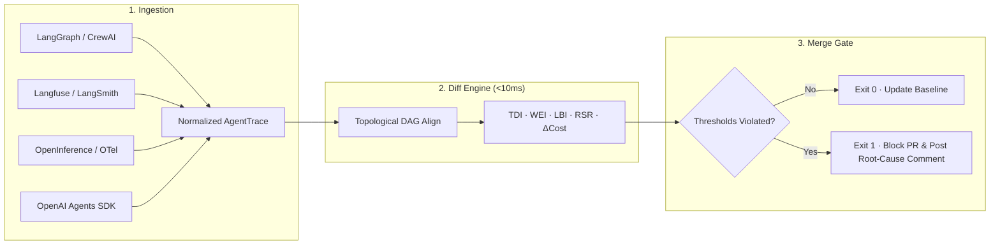

<div align="center">


# AgentDiff

**Catch silent cost surges and broken agent loops before they ship.**

<p align="center">
  <a href="https://github.com/lostmartian/agentdiff/actions/workflows/ci.yml"></a>
  <a href="https://pypi.org/project/agent-trajectory-diff/"></a>
  <a href="https://pypi.org/project/agent-trajectory-diff/"></a>
  <a href="https://github.com/astral-sh/ruff"></a>
  <a href="LICENSE"></a>
  <a href="https://agentdiff.app"></a>
</p>

```bash
pip install agent-trajectory-diff
```

[Website & Interactive Docs](https://agentdiff.app) · [Cookbooks](cookbooks/) · [Live Demo Repo](https://github.com/lostmartian/agentdiff-demo) · [Changelog](CHANGELOG.md)

</div>

**AgentDiff** is a developer-first Python library, pytest plugin, and CLI for **regression testing multi-turn, tool-using AI agents by comparing execution paths (trajectories) head-to-head.**

When you change a prompt, tweak a system instruction, or upgrade an LLM, traditional assertions only verify that the final string matches. They miss the silent failures: **the agent took 5 extra tool calls, burned 3× the tokens, entered an infinite retry loop, or drifted from the verified execution path.**

AgentDiff aligns candidate execution DAGs against committed golden baselines in `<10ms` without calling any paid LLM judges.

## Highlights

- **Deterministic Graph Diffing:** Topological DAG alignment and Longest Common Subsequence (LCS) step comparison in `<10ms` with zero paid LLM-judge calls.
- **100% Local & Air-Gapped:** Zero telemetry, no cloud accounts, no network calls during diffs. Raw prompts and tool outputs never leave your machine or CI runner.
- **Drop-in CI Merge Gate:** Native exit codes (`0` pass / `1` regression fail) and automated GitHub Action PR comments with collapsed divergence trees and culprit attribution.
- **Universal Telemetry Adapters:** Seamlessly diff traces exported from **LangGraph**, **CrewAI**, **OpenAI Agents SDK**, **Langfuse**, **LangSmith**, **OpenInference / OpenTelemetry**, or generic JSON.
- **Config-as-Code & Goodhart Guard:** Commit thresholds in `agentdiff.toml` right next to your code. Flag drift when baseline gate definitions change.
- **First-Class Pytest Plugin:** Native `agentdiff_trace` fixture and `assert_no_regressions` assertion helper.

## Architecture



## Installation

```bash
# Using pip
pip install agent-trajectory-diff

# Using uv
uv add agent-trajectory-diff

# Global CLI tool (isolated environment)
uv tool install agent-trajectory-diff
```

Enable tab completion for bash, zsh, fish, or powershell:
```bash
agentdiff --install-completion
```

## Quickstart

### 1. Record a Golden Baseline
Record a canonical execution trace from any agent function without writing boilerplate telemetry:

```bash
agentdiff record my_agent:run --input '{"query": "summarize repo"}' --out baselines/golden.json
```

### 2. Compare Traces in CLI
Compare candidate runs against your golden baseline:

```bash
agentdiff baselines/golden.json traces/candidate.json --fail-on-regression --max-divergence 0.25
```

### 3. Pytest Regression Testing
Enforce trajectory parity directly in your test suite:

```python
import pytest
from agentdiff import load_trace, compare
from agentdiff.testing import assert_no_regressions

def test_agent_refactor_efficiency():
    # Load traces (auto-detects telemetry source format)
    baseline = load_trace("tests/baselines/golden.json")
    candidate = load_trace("tests/traces/candidate.json")

    # Run sub-10ms deterministic comparison
    report = compare(baseline, candidate)

    # Assert no structural drift, cost surges, or tool loops
    assert_no_regressions(
        report,
        max_divergence=0.25,        # Max Trajectory Divergence Index [0.0 - 1.0]
        max_cost_increase_pct=5.0,  # Max 5% token cost increase
        allow_loops=False,          # Reject repetitive tool call cycles
        max_wasted_effort=0.10,     # Max 10% error/retry/abandoned steps
        max_recovery_step_ratio=1.5 # Max recovery steps relative to baseline
    )
```

## Config-as-Code (`agentdiff.toml`)

Commit your gate policy directly to your repository. AgentDiff auto-discovers `agentdiff.toml` in your working directory tree:

```toml
[compare]
detect_loops = true
strict_tool_signatures = false

[adapter]
name = "auto"            # auto, generic, openinference, langfuse, langsmith, openai_agents

[cli]
format = "terminal"      # terminal, json, markdown, pr
baseline = "baselines/golden.json"
max_loops = 0
max_divergence = 0.25
max_cost_delta = 5.0
max_recovery_ratio = 1.5

[assertions]             # Defaults for assert_no_regressions / pytest plugin
max_divergence = 0.25
max_cost_increase_pct = 5.0
allow_loops = false
max_wasted_effort = 0.10
max_recovery_step_ratio = 1.5
```

## GitHub Actions CI Gate

Block broken agent PRs before they land in production using the official composite action:

```yaml
name: AgentDiff Regression Gate

on:
  pull_request:

permissions:
  contents: read
  pull-requests: write   # Allows posting automated root-cause PR comments

jobs:
  agent-regression-gate:
    runs-on: ubuntu-latest
    steps:
      - uses: actions/checkout@v4

      - uses: actions/setup-python@v5
        with:
          python-version: "3.11"

      - uses: lostmartian/agentdiff/.github/actions/agentdiff-check@v0.2.2
        with:
          baseline: baselines/golden.json
          candidate: traces/pr_candidate.json
          max-divergence: "0.25"
          max-cost-delta: "5.0"
          max-loops: "0"
          pr: ${{ github.event.pull_request.number }}
          github-token: ${{ secrets.GITHUB_TOKEN }}
```

When a regression occurs, the gate fails with exit code `1` and comments on the PR with culprit identification and a collapsed divergence tree:

```markdown
### AgentDiff Gate: REGRESSION DETECTED

| Metric | Baseline | Candidate | Threshold | Status |
| :--- | :--- | :--- | :--- | :--- |
| **Divergence (TDI)** | 0.00 | 0.42 | ≤ 0.25 | FAIL |
| **Cost Surge** | $0.0042 | $0.0138 (+228%) | ≤ +5.0% | FAIL |
| **Loops (LBI)** | 0 | 3 loops | 0 | FAIL |
| **Wasted Effort (WEI)**| 0.00 | 0.38 | ≤ 0.10 | FAIL |

**Culprit Step:** Step 4 `execute_sql` entered a 3× retry loop after schema refactor.
```

## Core Metric Mathematics

| Metric | Target / Range | Algorithmic Definition | Description |
| :--- | :--- | :--- | :--- |
| **Trajectory Divergence Index (TDI)** | `0.0` (Identical) to `1.0` (Divergent) | $$1.0 - \frac{2 \times \vert{}\text{LCS}(\text{Steps}_A, \text{Steps}_B)\vert{}}{\vert{}\text{Steps}_A\vert{} + \vert{}\text{Steps}_B\vert{}}$$ | Structural distance between baseline and candidate execution DAGs using Longest Common Subsequence. |
| **Wasted Effort Index (WEI)** | `0.0` (Optimal) to `1.0` (Total Waste) | $$\frac{\text{Count}(\text{Steps} \in \{\text{ERROR, RETRY, ABANDONED}\})}{\text{Total Steps}}$$ | Fraction of execution steps spent in failed, retried, or aborted tool operations. |
| **Loop Buster Index (LBI)** | Integer ($\ge 0$) | Stagnant State Cycle Detection | Counts repeating consecutive tool call patterns where inputs/outputs show no state progression. |
| **Recovery Step Ratio (RSR)** | `1.0` = Parity; $> 1.0$ = Slower Recovery | $$\text{RSR} = \frac{\text{Recovery Steps}_{\text{candidate}}}{\text{Recovery Steps}_{\text{baseline}}}$$ | Measures the number of steps required to return to the verified golden trajectory path after encountering an error. |
| **Resource Deltas ($\Delta\text{Res}$)** | Percentage ($\pm\%$) | $\frac{\text{Val}_{\text{candidate}} - \text{Val}_{\text{baseline}}}{\text{Val}_{\text{baseline}}} \times 100$ | Exact percentage deltas for $\Delta\text{Tokens}$, $\Delta\text{Cost}$, and $\Delta\text{Latency}$. |

## Supported Telemetry Formats

| Telemetry Framework / Format | Adapter Spec | Ingestion Guide |
| :--- | :--- | :--- |
| **LangGraph / LangChain** | `--adapter langgraph` | [`cookbooks/langgraph`](cookbooks/) |
| **CrewAI** | `--adapter crewai` | [`cookbooks/crewai`](cookbooks/) |
| **OpenAI Agents SDK** | `--adapter openai_agents` | [`cookbooks/openai_agents`](cookbooks/) |
| **Langfuse** | `--adapter langfuse` | [`cookbooks/langfuse`](cookbooks/) |
| **LangSmith** | `--adapter langsmith` | [`cookbooks/langsmith`](cookbooks/) |
| **OpenInference / OpenTelemetry** | `--adapter openinference` | [`cookbooks/openinference`](cookbooks/) |
| **Generic JSON Schema** | `--adapter generic` | [`schema/v0.1.0/trace.json`](schema/v0.1.0/trace.json) |

## Local-First Privacy Guarantee

Agent trajectories often contain proprietary prompts, sensitive tool payloads, and customer data. AgentDiff is engineered with strict local-first principles:

- **Zero Outbound Network Traffic:** Parsing, DAG diffing, metric calculations, and reporting run 100% locally.
- **Air-Gapped & Firewall Friendly:** Run tests on laptops, in air-gapped VPCs, or under strict enterprise egress policies.
- **Repo-Committed Baselines:** Your golden trajectories live in Git next to the code they protect.
- **No Third-Party APM Lock-In:** Switch tracing providers at any time; AgentDiff normalizes all schemas to a unified specification.

## Documentation & Cookbooks

- **Official Documentation:** [https://agentdiff.app](https://agentdiff.app)
- **Live Demo Repository:** [github.com/lostmartian/agentdiff-demo](https://github.com/lostmartian/agentdiff-demo)
- **Engine Specification:** [Under the Hood](https://agentdiff.app/features)
- **Interactive Visualizer:** [Diff Playground](https://agentdiff.app/compare)
- **Adapters Guide:** [Framework Integration](https://agentdiff.app/adapters)

## Development

This repository uses [`uv`](https://docs.astral.sh/uv/) for lightning-fast environment and dependency management.

```bash
# Clone the repository
git clone https://github.com/lostmartian/agentdiff.git
cd agentdiff

# Install dependencies and sync virtualenv
uv sync

# Run linting and code formatting checks
make lint

# Run the test suite
make test

# Build package distributions
make build

# Launch the website & docs locally
make website-dev
```

## License

Distributed under the **MIT License**. See [`LICENSE`](LICENSE) for more information.
