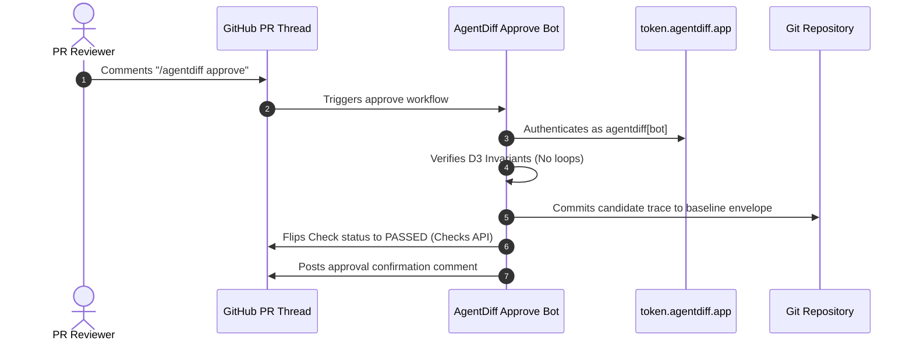

# The Interactive Approve Bot (`/agentdiff approve`)

When an engineer improves an agent's execution path (e.g. optimizing a 5-step workflow into 2 steps, or changing a prompt's tool call order), the trajectory intentionally diverges from the golden baseline.

Rather than checking out the branch locally, recording a new baseline, and committing manual JSON files, reviewers can approve the candidate run directly from the GitHub Pull Request thread by commenting:

```text
/agentdiff approve
```

---

## 1. How the Flow Works



---

## 2. Setting Up the Approve Bot

### Option A: `agentdiff init --with-approve` (Recommended)

When initializing your repository, pass `--with-approve`:

```bash
agentdiff init --with-approve
```

This generates `.github/workflows/agentdiff-approve.yml` configured with permissions, commenter write-access checks, concurrency guards, and artifact handoff.

### Option B: Three Identity Tiers

The approve bot supports three authentication tiers that degrade gracefully:

1. **Hosted Identity (Zero Config)**: When the [AgentDiff CI GitHub App](https://github.com/apps/agentdiff-ci) is installed on your repository, the workflow mints a short-lived (≤1 hour) token from `token.agentdiff.app`. Comments appear branded as **`agentdiff[bot]`**.
2. **Self-Managed GitHub App**: Set `AGENTDIFF_APP_ID` and `AGENTDIFF_APP_PRIVATE_KEY` repository secrets for dedicated organization-owned bots.
3. **Default `GITHUB_TOKEN`**: If no App is installed, the bot operates seamlessly using the repository's native `GITHUB_TOKEN` and posts comments as `github-actions[bot]`, flipping the check result green via the Checks API.

---

## 3. D3 Safety Policy: Invariants Are Never Blessable

AgentDiff enforces a strict separation between soft variations and structural bugs:

| Condition | Example | Blessable via `/agentdiff approve`? |
|---|---|---|
| **Path Drift** | New tool sequence, alternative valid route | ✅ **Yes** (Human judgment) |
| **Cost / Token Increase** | +15% token usage due to better context | ✅ **Yes** (Human judgment) |
| **Cyclical Loops** | Same tool repeated with stagnant arguments | ❌ **NEVER** (Strictly blocked) |
| **Error Cascades** | ≥ 3× recovery steps spent looping on errors | ❌ **NEVER** (Strictly blocked) |

If a PR contains an infinite loop, commenting `/agentdiff approve` will output an error refusing to bless the broken run until the underlying bug is fixed.

---

## 4. CLI Command Reference

The approve bot workflow executes the `agentdiff approve` CLI command behind the scenes:

```bash
agentdiff approve <baseline_path> <candidate_path> [--scenario <name>] [--runs <N>] [--pr <number>]
```

Example:

```bash
agentdiff approve baselines/customer_support.envelope.json traces/pr_candidate.json --pr 42
```
